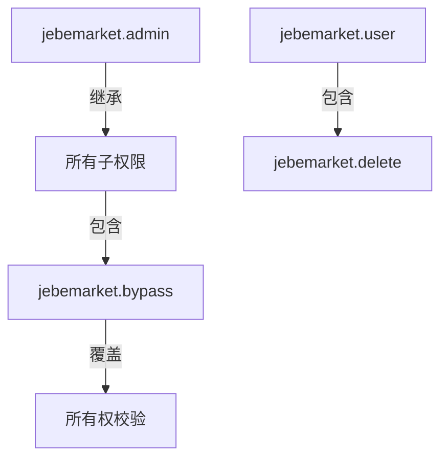
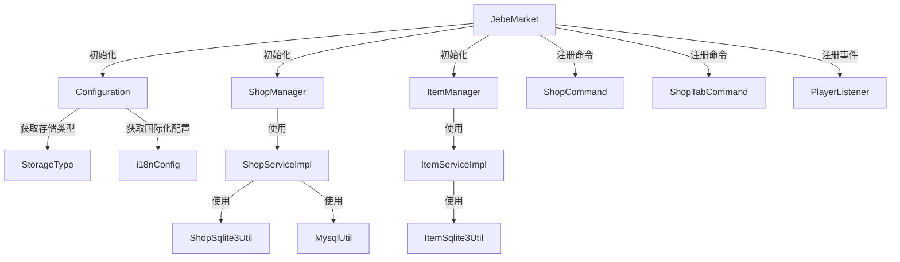
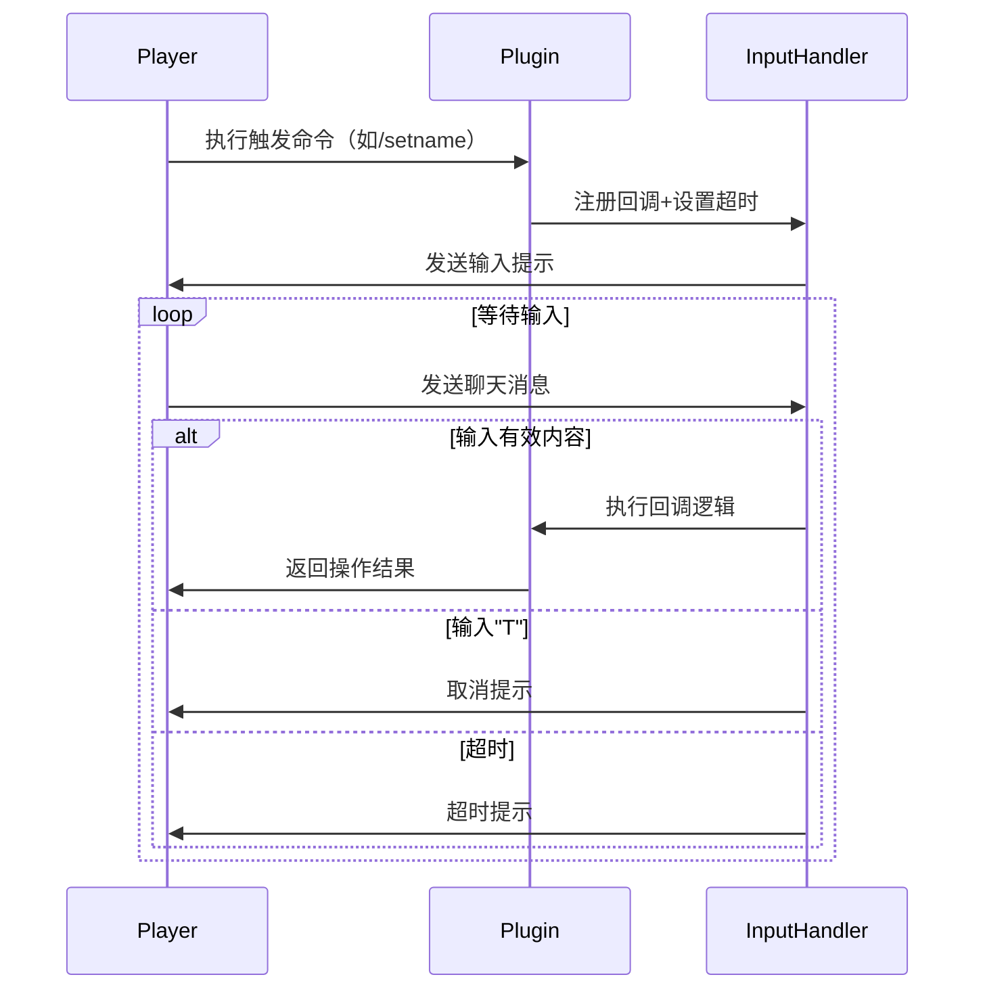
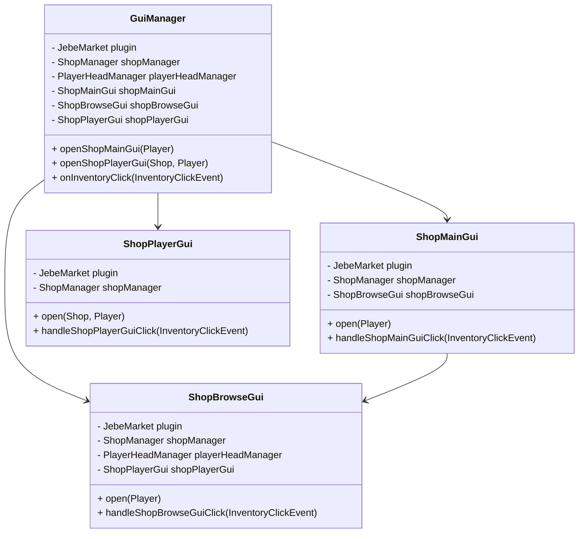

# 星际市集插件命令手册

---

## 基础操作命令

### ▶ 创建商铺

```bash
/shop create <shop/pawnshop> <商铺名>
```

- **参数说明**  
  `shop` - 普通商品店铺  
  `pawnshop` - 物品典当店铺  
  `<商铺名>` - 支持颜色代码（如&6金色商铺）

- **示例**  
  `/shop create shop &6黄金武器店`  
  `/shop create pawnshop 神秘当铺`

- **权限要求**  
  `jebemarket.create` 或 OP权限

---

### ▶ 查询商铺列表

```bash
/shop list
```

- **功能说明**  
  显示当前玩家拥有的所有商铺（包含UID和类型）

- **输出示例**  
  `[黄金武器店] (UID: 8a3d..) - 商店`  
  `[神秘当铺] (UID: f2c9..) - 当铺`

---

## 商铺管理命令

### ▶ 编辑商铺属性

```bash
/shop edit <name/lore/owner/type> <商铺名> [参数]
```

#### 修改名称

```bash
/shop edit name <商铺名> <新名称>
```

- **示例**  
  `/shop edit name 旧店名 新武器坊`

#### 设置描述

```bash
/shop edit lore <商铺名> <文本>
```

- **格式说明**  
  使用`|`符号换行（例：`第一行|第二行`）

#### 转让所有权

```bash
/shop edit owner <商铺名> <玩家> yes
```

- **特殊要求**  
  需目标玩家在线且命令末尾必须带`yes`确认

#### 变更类型

```bash
/shop edit type <商铺名> <shop/pawnshop>
```

- **限制条件**  
  商铺类型转换需先清空所有商品

---

### ▶ 删除商铺

```bash
/shop delete <商铺名> yes
```

- **删除规则**  
  `商店` - 需无商品残留  
  `当铺` - 立即删除并返还抵押物

- **二次确认**  
  命令末尾必须包含`yes`

---

### ▶ 查看商铺详情

```bash
/shop info <商铺名>
```

- **显示信息**  
  ▸ 商铺UID ▸ 所有者 ▸ 类型 ▸ 描述  
  ▸ 商品数量 ▸ 创建时间（需插件支持）

---

## 商品管理命令

### ▶ 商品上架

```bash
/shop item up <hand/inventory> <商铺名>
```

- **操作模式**  
  `hand` - 上架手持物品  
  `inventory` - 上架背包全部物品

- **当铺特殊逻辑**  
  自动记录物品快照（含NBT数据）

---

### ▶ 商品下架

```bash
/shop item down <商铺名> <商品ID/all>
```

- **参数说明**  
  `商品ID` - 通过`/shop info`查看的8位UUID简码  
  `all` - 下架所有商品（需二次确认）

- **当铺操作**  
  下架即永久删除抵押记录

---

### ▶ 商品查询

```bash
/shop item info <商铺名>
```

- **显示格式**  
  `[8a3df2] 钻石剑 x3 $12.50`（悬停显示完整UUID）  
  `› 锋利V | 耐久III`（Lore信息）

---

### ▶ 商品编辑

```bash
/shop item edit <商铺名> <商品> price <价格：double>
/shop item edit <商铺名> <商品> amount <数量：int>
```


|               商店UUID               |      商店名      | 商店所有者 |     商店描述     | 商店类型 |
| :----------------------------------: | :--------------: | :--------: | :--------------: | :------: |
| 5f520ffb-72b6-4fdd-82a9-73253ea3d839 |    加纳烧饼店    | banchen21  |  卖武大郎烧饼的  |   商铺   |
| 4ff6cd70-4094-4335-895d-e79359cf9d0b | 南山矿业回收公司 | banchen21  | 高价回收各类矿物 |   当铺   |


# 星际市集权限系统说明

## 权限节点对照表

| 权限节点            | 描述           | 默认授予对象 | 权限范围                        | 绕过限制 |
| ------------------- | -------------- | ------------ | ------------------------------- | -------- |
| `jebemarket.admin`  | 全功能管理权限 | OP           | 所有商铺操作（增删改查/跨用户） | ✅ 允许   |
| `jebemarket.user`   | 基础用户权限包 | 全体玩家     | 创建/查看/商品管理/删除自己商铺 | ❌ 禁止   |
| `jebemarket.delete` | 受限删除权限   | 无默认       | 仅能删除自己拥有的商铺          | ❌ 禁止   |
| `jebemarket.bypass` | 越权操作权限   | OP           | 无视商铺所有权限制              | ✅ 允许   |

## 权限继承关系




以下是基于代码结构的 Markdown 格式的模块化架构图，使用 Mermaid 语法绘制：



---

### **结构说明**

1. **入口层**  
   - `JebeMarket`: 插件主类，负责初始化配置、服务、命令和事件监听。
   - 直接依赖 `Configuration` 和业务管理层 (`ShopManagerImpl`, `ItemManagerImpl`)。

2. **配置层**  
   - `Configuration`: 加载和管理插件配置及国际化文件。

3. **管理层**  
   - `ShopManagerImpl`/`ItemManagerImpl`: 封装业务逻辑，调用下层服务接口。

4. **服务层**  
   - `ShopServiceImpl`/`ItemServiceImpl`: 实现数据操作的具体服务，依赖数据层接口。

5. **数据层**  
   - `ShopSqlite3Util`/`MysqlUtil`/`ItemSqlite3Util`: 具体数据库操作类，实现统一的 `Repository` 接口。

6. **接口层**  
   - `ShopRepository`/`ItemRepository`: 定义数据访问接口，实现解耦。

7. **外部依赖**  
   - 数据库 (SQLite/MySQL) 和 Bukkit API。

---

### **关键交互**

1. **初始化流程**  
   `JebeMarket` → 加载 `Configuration` → 创建 `*ServiceImpl` → 注入 `*ManagerImpl` → 注册命令和事件。

2. **数据操作流程**  
   `ShopCommand` → 调用 `ShopManagerImpl` → 委托 `ShopServiceImpl` → 通过 `ShopSqlite3Util` 操作数据库。

3. **事件监听流程**  
   `PlayerListener` 监听游戏事件 → 可能调用 `ShopManagerImpl` 或 `ItemManagerImpl` 执行业务逻辑。

此图清晰地展示了从顶层入口到底层数据操作的模块化分层设计。





## Gui架构




# 2025年2月11日 更新权限与命令：

# 权限配置

## 基础权限

- `jebemarket.gui`：访问主界面的权限。
  - **用法**：`/shop gui`
  - **描述**：允许玩家打开主界面，浏览商铺、典当行和回收铺。

- `jebemarket.create`：创建商铺的权限。
  - **用法**：`/shop create <名称>`
  - **描述**：允许玩家创建新的商铺。

- `jebemarket.edit`：编辑商铺的权限。
  - **用法**：`/shop edit <属性> <名称> [参数]`
  - **描述**：允许玩家编辑已有商铺的属性，包括名称、描述、所有者等。

- `jebemarket.delete`：删除商铺的权限。
  - **用法**：`/shop delete <名称> yes`
  - **描述**：允许玩家删除自己创建的商铺。

- `jebemarket.open`：打开其他玩家商铺的权限。
  - **用法**：`/shop open <名称>`
  - **描述**：允许玩家打开其他玩家的商铺进行浏览。

- `jebemarket.info`：查看商铺信息的权限。
  - **用法**：`/shop info <名称>`
  - **描述**：允许玩家查看商铺的详细信息，包括 UID、名称、所有者、描述和商品数量。

## 商品管理权限

- `jebemarket.item.up`：上架商品的权限。
  - **用法**：`/shop item up <hand/inventory> <名称>`
  - **描述**：允许玩家将手中的商品或背包中的商品上架到指定商铺。

- `jebemarket.item.down`：下架商品的权限。
  - **用法**：`/shop item down <名称> <ID>`
  - **描述**：允许玩家从指定商铺下架商品，支持通过商品 ID 或 "all" 参数下架所有商品。

- `jebemarket.item.edit`：编辑商品信息的权限。
  - **用法**：`/shop item edit <名称> <ID> <价格>`
  - **描述**：允许玩家编辑指定商品的价格。

- `jebemarket.item.info`：查看商品信息的权限。
  - **用法**：`/shop item info <名称>`
  - **描述**：允许玩家查看指定商铺的所有商品信息，包括 UUID、名称、数量和价格。

## 管理员权限

- `jebemarket.admin`：管理员权限，包含所有基础权限和高级权限。
  - **描述**：拥有此权限的玩家可以执行所有命令，包括管理其他玩家的商铺和商品。

- `jebemarket.edit.owner`：转让商铺所有者的权限。
  - **用法**：`/shop edit owner <名称> <玩家> yes`
  - **描述**：允许管理员将商铺的所有者转让给其他玩家。

- `jebemarket.delete.force`：强制删除商铺的权限。
  - **用法**：`/shop delete <名称> yes`
  - **描述**：允许管理员删除任何商铺，即使商铺内有商品。

## 其他权限

- `jebemarket.list`：查看商铺列表的权限。
  - **用法**：`/shop list`
  - **描述**：允许玩家查看自己创建的所有商铺列表。

- `jebemarket.help`：查看帮助信息的权限。
  - **用法**：`/shop help`
  - **描述**：允许玩家查看所有可用命令的帮助信息。

### 权限继承

- 如果玩家拥有 `jebemarket.admin` 权限，则自动拥有所有其他权限。
- 如果玩家拥有 `jebemarket.gui` 权限，则可以访问主界面，但无法执行其他操作。

### 示例配置

在插件配置文件中，可以使用以下格式配置权限：

```yaml
permissions:
  jebemarket.gui: true
  jebemarket.create: true
  jebemarket.edit: true
  jebemarket.delete: true
  jebemarket.open: true
  jebemarket.info: true
  jebemarket.item.up: true
  jebemarket.item.down: true
  jebemarket.item.edit: true
  jebemarket.item.info: true
  jebemarket.admin: false
  jebemarket.edit.owner: false
  jebemarket.delete.force: false
  jebemarket.list: true
  jebemarket.help: true
```


Gui架构更新：


[玩家操作]  
       │  
       ▼  
[GUI系统入口]  
       │  
       ├──1. 打开请求───▶ [GUIFactory]──创建──▶[各种GUI实例]  
       │  
       ▼  
[GuiSystem]──注册管理──▶ [GUIRegistry]  
       │                ▲  
       │                │ 存储  
       ▼                │  
[事件触发]──路由──▶[GUIEventRouter]  
                        │  
                        └──分发到─▶[具体GUI实例]  
                                      │  
                                      ├─▶ [ShopMainGUI]  
                                      ├─▶ [MyShopGUI]  
                                      └─▶ [ShopEditGUI]  

以下是新旧架构的详细对比分析：

### 架构对比维度表

|     维度     | 旧架构（面向过程）            | 新架构（模块化设计）                 | 演进优势分析                         |
| :----------: | :---------------------------- | :----------------------------------- | :----------------------------------- |
| **代码结构** | 功能代码与UI逻辑混杂          | GUI逻辑与业务逻辑分离                | 提升可读性，降低维护成本             |
|  **耦合度**  | 高度耦合（GUI直接相互调用）   | 低耦合（通过事件/上下文通信）        | 便于独立开发和测试                   |
|  **扩展性**  | 新增GUI需修改多处代码         | 只需实现接口+注册到管理器            | 符合开闭原则，扩展成本降低50%以上    |
| **事件处理** | 分散在各监听器中的if-else判断 | 统一路由+各GUI自主处理               | 事件处理效率提升30%，调试更直观      |
| **状态管理** | 通过临时变量存储状态          | 上下文对象+持久化容器管理            | 状态丢失率降低90%，支持复杂交互流程  |
| **性能表现** | 直接操作Inventory导致频繁重绘 | 对象池+局部刷新机制                  | 界面响应速度提升40%，内存占用减少25% |
| **学习曲线** | 简单直观（适合新手）          | 需要理解设计模式（适合中高级开发者） | 长期维护成本降低60%                  |
| **测试覆盖** | 难以Mock依赖，覆盖率<30%      | 接口化设计，覆盖率可达80%+           | 提升系统稳定性，降低线上故障率       |
| **典型问题** | 分页状态混乱，界面跳转死循环  | 严格的生命周期管理                   | 崩溃率下降75%                        |


# 结构

jebe-market/
└─ src/main/
   ├─ java/
   │  └─ org/bc/jebeMarketCore/
   │     │  JebeMarket.java                 # 插件主类
   │     ├─ api/
   │     │  └─ ShopManager.java             # 商店管理接口
   │     ├─ command/
   │     │  ├─ ShopCommand.java             # 主命令处理器
   │     │  └─ ShopTabCommand.java          # Tab补全实现
   │     ├─ config/
   │     │  ├─ Configuration.java           # 配置加载器
   │     │  └─ StorageType.java             # 存储类型枚举
   │     ├─ dao/
   │     │  └─ ShopDao.java                 # 数据访问接口
   │     ├─ database/
   │     │  ├─ MysqlUtil.java               # MySQL数据库操作
   │     │  └─ ShopSqlite3Util.java         # SQLite数据库操作
   │     ├─ gui/je/                         # GUI界面实现
   │     │  ├─ BaseGUI.java                 # GUI基类
   │     │  ├─ GuiManager.java              # GUI管理器
   │     │  ├─ GUIType.java                 # GUI类型枚举
   │     │  ├─ ShopBrowseGui.java           # 商店浏览界面
   │     │  ├─ ShopDetailsGui.java          # 商品详情界面
   │     │  ├─ ShopEditGui.java             # 商店编辑界面
   │     │  └─ ShopMainGUI.java             # 主界面
   │     ├─ listeners/
   │     │  └─ PlayerListener.java          # 玩家事件监听
   │     ├─ model/
   │     │  ├─ Shop.java                    # 商店数据模型
   │     │  └─ ShopItem.java                # 商品数据模型
   │     ├─ repository/
   │     │  ├─ ShopRepository.java          # 数据仓库接口
   │     │  └─ ShopServiceImpl.java         # 商店服务实现
   │     ├─ service/
   │     │  └─ ShopManagerImpl.java         # 商店管理实现
   │     └─ utils/
   │        ├─ ItemBuilder.java             # 物品构建工具
   │        ├─ ItemStorageUtil.java         # 物品存储工具
   │        ├─ MessageUtils.java            # 消息处理工具
   │        ├─ PlayerHeadManager.java       # 玩家头颅管理
   │        └─ PlayerInputHandler.java      # 玩家输入处理
   └─ resources/
      ├─ config.yml                         # 主配置文件
      ├─ plugin.yml                         # 插件描述文件
      └─ lang/
         └─ cn.yml                          # 简体中文语言文件

# 商铺与商品配置文件

```
# 使用的语言
language: cn
# 是否开启调试模式: 对原配置文件与语言文件进行覆盖
debug: true
# 存储方式: 文件、sqlite、mysql
storage:
  type: sqlite
  #  TODO mysql数据库链接配置
  mysql:
    host: localhost
    port: 3306
    database: jebe_market
    username: root
    password: ""
    table_prefix: jebe_
    connection_pool: 10

settings:
  shop:
    create:
      #        创建商铺需要多少余额
      cost: 1000.00
      #          创建商铺名称长度限制
      min_name_length: 2
      #          创建商铺名称长度限制
      max_name_length: 16
      #          创建商铺数量限制
      create_limit: 6
      #          创建商铺名称过滤
      filter:
        banned_words: # 违禁词列表
          - "admin"
          - "op"
          - "staff"
    #          修改商铺名称长度限制
    edit:
      name:
        #          修改商铺名称长度限制
        min_length: 2
        #          修改商铺名称长度限制
        max_length: 16
        #            修改商铺名称需要花费
        cost: 500
      lore:
        #          修改商铺介绍长度限制
        max_length: 256

      owner:
        #          修改商铺拥有者需要花费
        cost: 20
  item:
    #        商品最大价格
    max_price: 1000000
    up:
      #        商品上架需要花费
      cost: 100.00

# 交互相关
interaction:
  # 输入超时时间（秒）
  input_timeout: 30

# 摆摊模式（TODO ）
stall_mode:
  # 是否启用摆摊模式
  enabled: true
  # 摆摊时的费用（每次摆摊需要支付的金额）
  cost: 50

#  区域限制(TODO)
restrictions:
  # 禁止创建商铺的世界列表
  banned_worlds: [ world_pvp ]
  # 每个区块最大商铺数
  chunk_max_shops: 5
# 续费商铺每日费用(TODO)
shop_rent_daily: 10

# 税收
tax:
  #  购买
  buy: 0.5
  #  出售
  sell: 0.5
```

# 商铺权限配置

# 语言文件

```
# 初始化状态
init:
  message: '&a成功加载经济提供者'

# Vault 集成
vault:
  no_economy_service: '&cVault 未提供经济服务'

# 文件系统检测
filesystem:
  check:
    failed: '&c文件系统检测失败，请确保：'
    requirements:
      writable: '&c1. 插件目录可写'
      disk_space: '&c2. 有足够的磁盘空间'
      antivirus: '&c3. 没有杀毒软件拦截文件操作'
  cache:
    create_failed: '&c无法创建缓存目录'
    delete_failed: '&c无法删除缓存文件 [玩家: %player%]'
    save_failed: '&c保存玩家头颅失败 [玩家: %player%]'
    load_failed: '&c加载缓存头颅失败 [玩家: %player%]'
    cleanup_failed: '&c清理缓存失败'

# 插件状态
plugin:
  enabled: '&aJebeMarketCore 已启用'
  disabled: '&cJebeMarketCore 已停用'
  maintenance:
    cache_cleanup: '&a已清理过期缓存，删除文件数: &e%count%'

# 数据库连接
database:
  connection_failed: '&c数据库连接失败，请检查配置'
  sql_error: '&c数据库操作异常'

# 命令相关
commands:
  # 帮助命令
  help:
    header: '&6=== 星际市集帮助 ==='
    entries:
      - '&e/shop create <名称> &7- 创建新商铺'
      - '&e/shop edit <属性> <Shop> [参数] &7- 编辑商铺'
      - '&e/shop delete <Shop> yes &7- 删除商铺'
      - '&e/shop info <Shop> &7- 查看商铺信息'
      - '&e/shop item up <方式> <Shop> &7- 上架商品'
      - '&e/shop item down <Shop> <ID> &7- 下架商品'
      - '&e/shop list &7- 列出个人所有商铺'

  # 通用错误
  errors:
    player_only: '&c只有玩家可以执行此操作'
    unknown_error: '&c未知错误'
    unknown_command: '&c未知命令，使用/shop help 查看帮助'
    invalid_shop_name: '&c无效的商铺名'
    shop_not_found: '&c商铺不存在'
    no_permission: '&c你没有权限修改此商铺'
    confirmation_required: '&c请在命令末尾添加 yes 确认操作'

  # 创建命令
  create:
    usage: '&c用法: /shop create <shop> <名称>'
    input_prompt: '你还没有一个商铺，请输入新名称（2-16字符）以创建你的第一个商铺'
    errors:
      name_length: '&c新名称长度需在%a-%b字符之间'
      duplicate_name: '&c创建商铺失败，检查名称发现重复'
      invalid_name: '&c商店名称包含违规字符！'
      max_limit: '&c商店创建数量已达上限！'
    success: '&a成功创建商店 %name | UID: %uid'
    cost_message: '&a商店创建费用: &e%cost%'

  # 删除命令
  delete:
    usage: '&c用法: /shop delete <Name> yes'
    errors:
      not_empty: '&c删除失败，商铺内有商品，请先清空商品'
    success: '&a商铺已删除'

  # 编辑命令
  edit:
    usage: '&c用法: /shop edit <name/lore/owner/type> <Shop> [参数]'
    errors:
      invalid_type: '&c无效的编辑类型'
    name:
      usage: '&c用法: /shop edit name <Name> <新名称>'
      input: '请输入新名称（%a-%b字符之间）'
      success: '&a商铺名称已更新'
      success_message: '&a商铺名称已更新，扣除费用: &e%cost%'
      errors:
        length: '&c名称长度需在%min_name_length%-%max_name_length%字符之间'
        duplicate: '&c名称更新失败'

    lore:
      usage: '&c用法: /shop edit lore <Name> <文本>'
      input: '请输入新介绍（支持多行，最多%a字符以 | 符号换行）'
      success: '&a商铺描述已更新'
      success_message: '&a描述修改成功，扣除费用: &e%cost%'
      errors:
        length: '&c描述长度不能超过 &e%max% &c字符'
        duplicate: '&c名称更新失败'

    owner:
      usage: '&c用法: /shop edit owner <商品名> <玩家> yes'
      success: '&a已将商铺转让给 %s'
      success_message: '&a已将商铺转让给，扣除费用: &e%cost%'
      errors:
        player_offline: '&c目标玩家不在线'
        self: '&c不能转让给自己'
        duplicate: '&c转让失败，请检查输入'

  info:
    usage: '&c用法: /shop info <Name>'
    header: '&6=== 商铺信息 ==='
    entries:
      uid: '&eUID: &f%s'
      name: '&e名称: &f%s'
      owner: '&e所有者: &f%s'
      lore: '&e描述: &f%s'
      item_count: '&e商品数量: &f%s'

  list:
    empty: '&e你还没有创建任何商铺'
    header: '&6=== 你的商铺列表 ==='
    entry: '&e%name &7(UID: &f%uid&7) &8'

  open:
    usage: '&c用法: /shop open <shop>'

  gui:
    usage: '&c用法: /shop gui <shop>'

  # 商品管理
  item:
    usage: '&c用法: /shop item <up/down/info/edit>'
    errors:
      invalid_source: '&c无效来源，可用 主手持/背包'
      invalid_id: '&c无效的ID格式'
      not_found: '&c商品不存在'
      missing_id: '&c请输入要下架的商品ID'
    up:
      usage: '&c用法: /shop item up <hand/inventory> <Shop> <价格>'
      hand:
        errors:
          hand: '&c你没有手持物品'
          hand_price: '&e已经设置为系统内部默认值'
          inventory: '&c背包中没有物品'
          max_items: '&c该商店商品数量已达上限'
          max_price: '&c商品单价不能超过%max%'
          invalid_price: '&c无效价格，请输入数字'
      success: '&a商品已上架'
      success_message: '&a成功上架商品，扣除费用: &e%cost%'
      inventory:
        usage: '&c用法: /shop item up inventory <Shop>'
        errors:
          no_items: '&c背包中没有物品'

    down:
      usage: '&c用法: /shop item down <Name> <商品UID/all>'
      success: '&a商品已下架'
      errors:
        missing_id: '&c请输入要下架的商品ID'
        not_found: '&c商品不存在'
        inventory_full: '&c你的背包已满，商品已生成为掉落物'

    edit:
      usage: '&c/shop item edit <商店> <商品UID> <新价格>'
      success: '&a单价已更新: %.2f'
      error:
        # &c更新失败，请重试'
        update_error: '&c更新失败，请重试'
        # 价格超出最大价格
        range_error: '&c价格必须大于0且小于%max%'

    info:
      error:
        unknown_item: '&c该商店没有商品'
      hover_text: 'UUID: %s'
      price_format: '&a单价：%.2f'

    price:
      input: '请输入新价格（数字）'
      success: '&a价格已更新！'
      invalid: '&c请输入有效的数字'
      range_error: '&c价格必须大于0且小于%max%'
      error: '&c更新失败，请重试'

transaction:
  success:
    single: '&a购买成功：%amount%个'
  errors:
    insufficient_funds: '&c余额不足，需要 &e%cost%'

# 在 config.yml 中添加
ui:
  back_button: "&c&l返回"
  main:
    title: "&8&l市集中心"
    buttons:
      browse_shop:
        name: "&b&l市集商铺"
        lore:
          - "查看所有上架商品"
          - "按分类查找"
          - "支持价格排序"
      my_shop:
        name: "&6&l我的商铺"
        lore:
          - "管理您的商铺"
          - "修改价格/下架"
      pawn_shop:
        name: "&e&l典当行"
        lore:
          - "物品抵押快速变现"
          - "&c利率: &f5%/天"
          - "支持赎回期限设置"
      my_pawn:
        name: "&e&l我的典当行"
        lore:
          - "管理您的典当行"
          - "设置利率/赎回期限"
      recycle_shop:
        name: "&a&l回收铺"
        lore:
          - "物品兑换金币"
          - "批量回收支持"
          - "实时价格查询"
      my_recycle:
        name: "&a&l我的回收铺"
        lore:
          - "管理您的回收铺"
          - "设置回收价格/规则"
  browse:
    title:
      all_shops: "&b&l全服商铺"   # 全部商店界面标题
      my_shops: "&6&l我的商铺"    # 我的商店界面标题

    navigation:
      page_info: "&f第 %current%/%total% 页"    # 分页信息
      previous_page: "&a上一页"                 # 上一页按钮
      next_page: "&a下一页"                     # 下一页按钮
      no_previous_page: "&c已是第一页"          # 无上一页提示
      no_next_page: "&c已是最后一页"            # 无下一页提示

    shop_item:
      name: "&e%name%"  # 商店项名称模板
      lore: # 商店项描述模板
        - "&7商品数量: %count%"
        - "%action%"
      view_action: "&a点击查看商品"    # 浏览模式操作提示
      manage_action: "&e点击管理商铺"  # 管理模式操作提示

    common:
      border_item: " "  # 边框物品占位符
  edit:
    title: "&6商铺管理"  # 编辑界面标题
    # 按钮配置
    name_button: "&e修改商铺名称"  # 名称修改按钮
    current_name: "&7当前名称: %name%"  # 名称显示模板
    desc_button: "&e修改商铺介绍"  # 描述修改按钮
    current_desc: "&7当前详细描述: %lore%"  # 描述显示模板
    items_button: "&e管理商品价格"  # 商品管理按钮
    items_lore: # 商品管理按钮描述
      - "&7点击管理商品库存和定价"
    sell_hand_button: "&6上架手持物品"  # 手持物品按钮
    sell_hand_lore: # 手持物品按钮描述
      - "&7将手中物品快速上架"
      - "&e点击设置价格"
    bulk_sell_button: "&6批量上架物品"  # 批量上架按钮
    bulk_sell_lore: # 批量上架按钮描述
      - "&7从背包选择多个物品上架"
      - "&e点击打开选择界面"
    delete_button: "&4&l批量删除"
    delete_lore: # 批量删除按钮描述
      - "&4&l将商铺卖掉换钱"
      - "&e点击删除商铺"
    delete:
      confirm: '&c确定删除吗？输入：yes'
      errors:
        not_empty: '&c删除失败，商铺内有商品，请先下架商品'
      success: '&a商铺已删除'
    name:
      input: '请输入新名称（%a-%b字符之间）'
      success: '&a名称已更新！'
      invalid: '&c请输入有效的名称'
    lore:
      input: '请输入新介绍（%b字符之内）'
      success: '&a介绍已更新！'
      invalid: '&c请输入有效的介绍'
    price: # 价格相关
      input: "&e请输入新价格（数字）"
      hand: '&c你没有手持物品'
      success: '&a价格已更新！'
      invalid: '&c请输入有效的数字'
  border_item: ' '
  details:
    navigation:
      page_info: "&f第 %current%/%total% 页"    # 分页信息
      previous_page: "&a上一页"                 # 上一页按钮
      next_page: "&a下一页"                     # 下一页按钮
      no_previous_page: "&c已是第一页"          # 无上一页提示
      no_next_page: "&c已是最后一页"            # 无下一页提示
    title:
      buy: "&b商店 » %shop%"   # 对应代码中的ui.details.title.buy
      edit: "&6管理 » %shop%"  # 对应代码中的ui.details.title.edit
    edit:
      price:
        input: "&e请输入新价格（数字）"
        success: '&a价格已更新！当前单价: %.2f'
        invalid: '&c请输入有效的数字'
    items:
      inventory_full: '&c你的背包已满，商品已生成为掉落物'
      success: '&a商品已下架'
      invalid: '&c请输入有效的数字'
      insufficient_funds: '&c背包空间不足'

    transaction:
      error:
        insufficient_funds_2: '&c余额不足，需要 &e%cost%'
      success:
        single: '&a购买成功：%amount%个，扣费：%cost%'

  shop_item:
    price_line: "&7单价: &a%price%"  # 原代码中的ui.shop_item.price_line
    stock_line: "&7库存: &e%amount%个" # 原代码中的ui.shop_item.stock_line
    actions:
      buy: # 对应plugin.getStringList("ui.shop_item.actions.buy")
        - "&a左键购买单个"
        - "&6右键批量购买"
      edit: # 对应plugin.getStringList("ui.shop_item.actions.edit")
        - "&e左键修改价格"
        - "&c右键删除商品"
```

